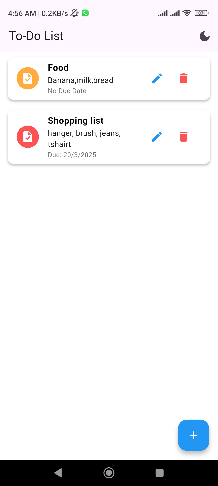
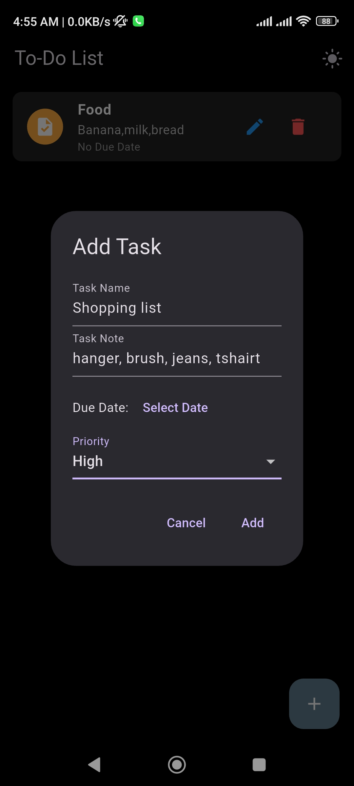
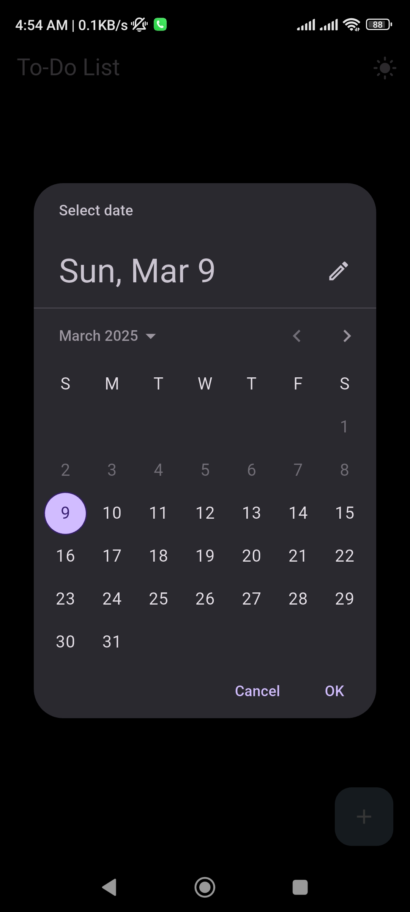
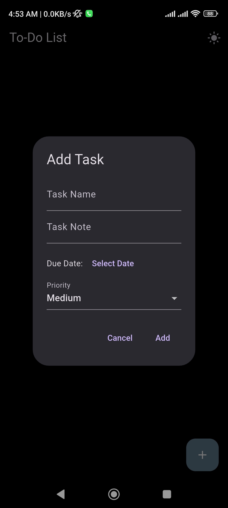

This is a to-do list app in Flutter with full CRUD (Create, Read, Update, Delete) functionality. The app also supports dark mode for an enhanced user experience.

## Screenshots

  
  
  

  
  
  

